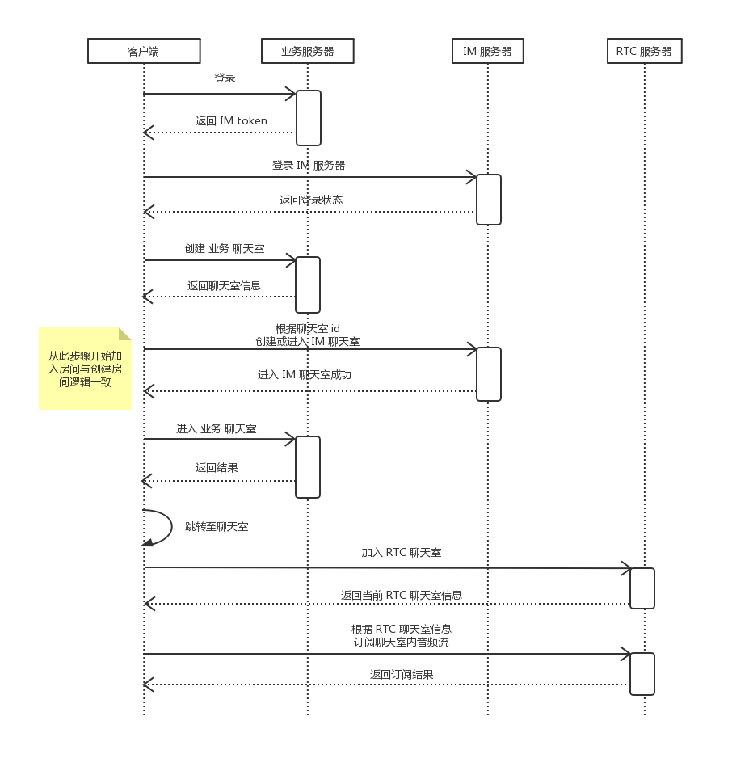
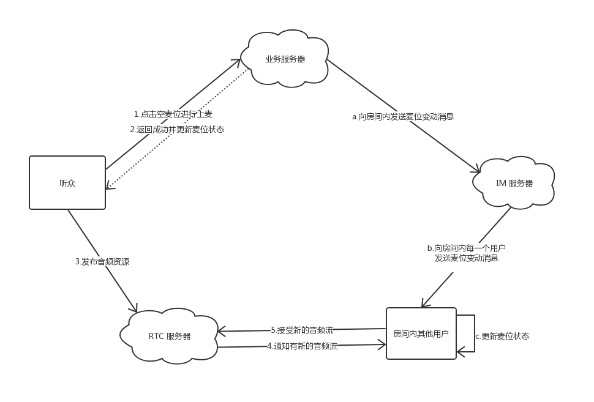
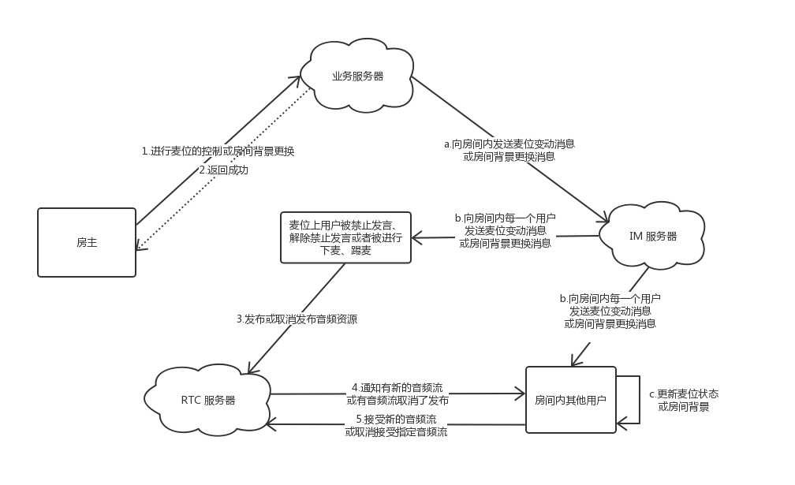

# android-push-settings-advisor
安卓手机推送设置指导。
## 简介
此组件主要是为了辅助解决内安卓手机上的推送到达率低的问题。组件提供推送所需权限方面的检测、提示和根据不同手机机型跳转不同权限设置界面的功能。

- **需求背景**：由于现在各种机型厂商和安卓系统的限制，假如想正常的接受消息或尽可能的长期在运行在后台，就需要开启手机的某系权限。所以开发此组件来检查不同的机型上推送所需要那些权限，进行提示并跳转设置。

- **组件功能：**
	-  检测推送所需的权限状态。
	-  提示跳转到相对应的权限设置界面去设置权限。
	-  针对不同的机型，做了不同的跳转界面的适配。


## 特别注意

-  由于有些手机开启自启动权限后，是通过系统的广播拉起应用。 但是由于 android 系统 API 26 及以上版本对隐式广播做了限制，导致可能收不到系统广播的问题。 则建议 target 版本最好设置 26 以下。

-  此组件只是提供去设置推送所需的权限的状态检测、提示、根据不同机型跳转设置权限界面的功能，没有具体的拉活的相关代码。 例如：通过开启自启动权限的方式拉活， 是需要您在自己代码中， 自己实现体统广播监听进行拉活的。


## 使用方法
- 导入此 Module 组件，然后在主工程的 Gradle 配置文件中添加 

``` xml
    api project(':pushpermission')
```


- 在代码中添加下面代码就可使用组件功能

```java
	 RongPushPremissionsCheckHelper.checkPermissionsAndShowDialog(Activity, new ResultCallback() {
            @Override
            public void onAreadlyOpened(String value) {
   
            }

            @Override
            public boolean onBeforeShowDialog(String value) {
               return false;
            }

            @Override
            public void onGoToSetting(String value) {
                
            }

            @Override
            public void onFailed(String value, FailedType type) {

            }
        });
```


**RongPushPremissionsCheckHelper** 类是主要的对外功能方法类。
 
**ResultCallback** 为回调接口， 可在 **onBeforeShowDialog** 方法中，在弹窗之前进行拦截操作。在此方法中可用于设置自己的弹窗机制。

具体的方法介绍可参考 **doc** 文件夹中的 [**API 文档**](./doc/index.html) 。

## 组件介绍
### 权限
组件中对三种权限进行检测并提示跳转。

- 自启动权限
	开启此权限后，部分手机则能收到系统广播通知（如，开机启动广播，解锁广播，电源插拔广播等）。可使用这些广播通知进行拉活。
- 通知显示权限
	开启此权限，可显示通知提示。 大多手机会自动开启， 少数手机需要自己手动设置。
- 保持应用权限
	即为手机上的锁屏存活，保持应用后台运行等权限。开启此权限可在一定程度能延长进程在后台的存活时间。 

### 架构组成

主要分为三部分：


- 检查权限状态
	- 目前通知权限可以检查
	- 自启动权限，小米手机可以检查。如果以后其他手机支持查询了，可进行扩展
- 权限设置页面跳转 Intent
	- 配置信息主要在 **config.xml** 文件中进行适配。
	
	```
	
		此配置文件是为了配置机型进行保活所需权限的权限设置界面的跳转信息配置。
		由于手机系统对保活的限制，需要开启某些特定的权限，并且某些手机所需的权限不一致。
	    所以在此页面进行配置以起到灵活适配的目的。
	    具体的信息配置规则如下，以小米为例：
	    <XIAOMI>
	        <AutoStart>
	            <IntentInfo>
	                <Package></Package>
	                <Clazz></Clazz>
	                <Action></Action>
	                <Data>
	                    <Key></Key>
	                    <Value></Value>
	                </Data>
	                 <Extra>
	                    <Key></Key>
	                    <Value></Value>
	                </Extra>
	                <SetPath></SetPath>
	            </IntentInfo>
	        </AutoStart>
	        <Notification> ... </Notification>
	        <Clean> ... </Clean>
	    </XIAOMI>
	
	    标签 XIAOMI ： 为手机的 Build.MANUFACTURER 字段的值。 当前为小米手机的 MANUFACTURER 值 （不区分大小写）。 不可为其他的，
	                   否则找到不到设置的机型。
	    标签 AutoStart ： 为自启动权限的配置。
	    标签 Notification ： 为通知权限的配置。
	    标签 Clean ： 为锁屏清理权限的配置。
	
	    后续如果需要添加别的权限跳转设置， 则会增加其他标签。
	
	    标签 IntentInfo : 为跳转中所要用到的的信息。 其中包括 package ， class， action 跳转中所需要的值。
	    标签 Data: intent 跳转所需的 data 数据。 有 Key 和 Value.  当 Value 值为 auto 的时候，则有代码内部自动获取值。
	    标签 Extra: intent 跳转所需的 Extra 数据。有 Key 和 Value.  当 Value 值为 auto 的时候，则有代码内部自动获取值。
	    标签 SetPath: 设置的界面路径
	
	    每个权限标签下可配置多个 IntentInfo。 这是为了兼容机型（因为有可能有的机型有，有的机型没有）。代码会全部解析出来，
	    并去检测配置的组件信息是否存在。如果存在则会直接使用当前的。后面的则不会再去验证。 如果没有再会再尝试下面的配置，
	    直到结束。所以，当有多个 IntentInfo 的时候， 建议把配置多的，优先的配置到前面，以提高检测效率。

	```
	
	
	- 然后有 ParseConfig 类进行解析封装成 ModelInfo。 在 IntentProvider 会根据配置每组权限的 Intent 信息查看此组件是否存在，如果不存在则继续检查下一下， 如果存在则会直接把当前的返回。
	
- 对外使用部分
	- 包括权限状态检查， 使用询问用户跳转设置和实施跳转权限设置页面部分逻辑


###  类图


## 加入我们

由于 Android 机型重多，希望更多的人加入我们，一起完善此组件， 适配组件尚未适配的机型。 

具体的适配方法， 即在 config.xml 文件中按照规则配置即可。

您也可进行留言，为我们提供您宝贵的建议。


# SealMic-Android  
本文档介绍了 SealMic 的整体框架设计和核心流程，为开发者了解 SealMic 的主要功能提供指导性说明。[体验 SealMic](https://www.rongcloud.cn/download/demo) 。

## 背景介绍
SealMic 展示了如何通过融云 RTCLib SDK 实现音频社交功能。

* **RTCLib SDK：融云实时音视频 SDK**

## 主要功能介绍  
SealMic 主要由两个页面构成：语音聊天室列表页和语音聊天室详情页面。  
* **语音聊天室列表页** &emsp;  
展示了当前所有创建的聊天室，可以选择加入某个聊天室或创建新聊天室。
* **语音聊天室详情页** &emsp;  
展示了当前语音聊天室内的麦位及用户信息。
所有在语音聊天室内的用户可以发送文字进行聊天。  
房主和在麦位上的用户可进行语音聊天。  
房主可针对麦位进行控制，比如限制在麦位上的用户发言或限制用户进行上麦操作。  
房主可更改聊天室的背景来使聊天室内所有的用户同时看见当前新的聊天室的背景。  

 ** 特别说明：为了重点演示 SealMic 核心功能，SealMic 中简化了部分逻辑：**
*  没有用户管理体系，而是根据用户 id 的 hashcode 值取余后生成对应资源的 index.


## 语音聊天室的概念
在 SealMic 中有三个抽象概念的语音聊天室，虽然使用相同的 id 但功能范围各不同：
* **业务层面的语音聊天室** &emsp;在用户创建聊天室时请求业务服务器，业务服务器创建聊天室，并返回给创者者当前聊天室的 id，同时其他用户可通过获取聊天室列表接口获取到此聊天室的 id。用户调根据此聊天室 id 加入 IM 聊天室和音频 RTC 房间。当前用户属于哪个聊天室，当前聊天室内有哪些用户是基于此聊天室。
* **IM 即时通讯层面的语音聊天室** &emsp;加入 IM 聊天室后，用户可以发送文本消息聊天。另外维护聊天室各种状态的信令消息也通过 IM 服务来收发。  
* **RTC 音频层面的语音聊天室** &emsp; 加入 RTC 聊天室后，用户可以获得到当前语音聊天室内所有发布音频流的用户，并选择订阅音频流来收听目标用户的声音，也可以自己发布音频流让其他人听到自己的声音。

以下是用户加入语音聊天室并进行语音聊天过程的时序。  

  

说明：为了防止用户在调用业务服务器加入聊天室与加入 IM 聊天室之间的消息丢失，需要先加入 IM 服务器，再调用业务服务器加入聊天室。
## 语音聊天室中的角色  
语音聊天室中一共有三个角色：
* **听众** &emsp; 加入聊天室后用户的默认角色。可以进行文字交流，并收听聊天室内其他用户的发言。可以选择空麦位进行上麦操作；或者由 *房主* 以抱麦形式上麦，上麦后成为 *连麦者* 进行语音发言。
* **连麦者** &emsp; 可进行语音发言，也可以随意更更改到其他空的麦位上，即跳麦；也可以选择下麦变回 *听众*。
* **房主** &emsp; 即语音聊天室的创建者。  
房主具有房间的控制能力。
房主可以更改聊天室中的麦位的状态。  
房主可以选择房间内的某个 *听众* 上麦，使其成为连麦者。  
房主可以使 *连麦者* 下麦变为 *听众* 或将 *连麦者* 踢出聊天室。  
房主可以更改聊天室内的背景使聊天室内的其他用户同步更新此背景。  
房主可以解散聊天室，当房主退出或者解散聊天室时聊天室内的其他用户会受到通知并退出聊天室。

## 语音聊天室中的麦位
在 SealMic 聊天室中一共有8个麦位，只有房主和在麦位上的用户可以进行发言。房主可以对麦位进行控制，麦位一共有以下几个状态：
* **空麦位** &emsp; 听众可以上麦，连麦者可进行跳麦到此麦位，房主可进行抱麦使听众上麦。
* **麦位被禁止发言** &emsp; 在禁止发言的麦位上，连麦者无法进行语音发言。
* **麦位被锁定** &emsp; 在被锁定的麦位上，听众无法进行上麦操作，连麦者无法进行跳麦操作。

## 用户上麦流程
以下流程图简述了听众进行上麦操作时，用户与各个服务器的之间的交互。  



## 房主抱麦流程
以下流程图简述了房主抱麦时，被抱麦的听众及其他用户与各个服务器之间的交互流程。  


## 房主麦位管理和更换聊天室背景流程
以下流程图简述了房主进行麦位控制和更换聊天室背景时，其他用户与各个服务器之间的交互并完成同步更新的流程。  




## 代码目录介绍  
Android 端代码主要由 ui，task，net，im，rtc 五个包组成。  
* **ui** &emsp;包含所有显示相关的组件。包含 聊天室界面 ChatRoomActivity，主界面和聊天室界面使用到一些控件。
* **task** &emsp;对于首页和聊天室内的业务处理。UI 层直接调用 task 包中的业务管理类进行业务操作，由这些管理类去调用 net，im，rtc 包中对应类的方法去实现相应操作并将结果反馈给 UI。主要业务由以下三个管理类实现： AuthManager 管理用户登录业务，RoomManager 管理聊天室相关业务，ThreadManager 管理线程。
* **net** &emsp;对于所有关于 SealMic 业务逻辑上的网络请求封装。网络部分使用 Retrofit 2.0 框架进行封装。
* **im** &emsp;对应 SealMic 中使用 融云 IMLib 对即时通讯部分的封装和自定义消息的实现。自定义消息包括聊天室麦位更改消息，聊天室背景改变消息。
* **rtc** &emsp;对应 SealMic 中使用 融云 RTCLib 对音频聊天相关的功能封装。

其他包由以下几个组成：
* **constant** &emsp;定义了网络相关常量和业务错误代码。
* **model** &emsp;业务中使用的模型对象和枚举。
* **utils** &emsp;包括日志打印，Toast 提示等辅助工具，随机资源素材管理。

在根目录下有以下两个类：
* **SealMicApp** &emsp;应用的 Application 类，在应用启动时初始化了 融云 IMLib 及其他组件。
* **MainActivity** &emsp;应用的主界面，展示了当前已创建的聊天室列表。

## 运行环境
* Android Studio 3.2&ensp;以上版本  
SealMic 适配了 Android X，所以需要 使用 3.2&ensp;以上版本的 Android Studio 才能保证可以正常编译和使用。
* 推荐使用真实 Android 设备  
部分模拟器会存在功能缺失或运行环境不稳定等情况影响使用体验。

## 文档链接
* 关于 Android IM 即时通讯 SDK 的 [开发指南](https://www.rongcloud.cn/docs/android.html)
* 关于 Android 音视频通讯 SDK 的 [开发指南](https://www.rongcloud.cn/docs/android_rtclib.html)
* SealMic Server 源码可以参考[这里](https://github.com/rongcloud/sealmic-server)  

## 联系我们  
* 如果发现了示例代码的 bug, 欢迎提交 [issue](https://github.com/rongcloud/sealmic-android/issues)
* 如果有售前咨询问题, 可以拨打 13161856839 进行咨询。
